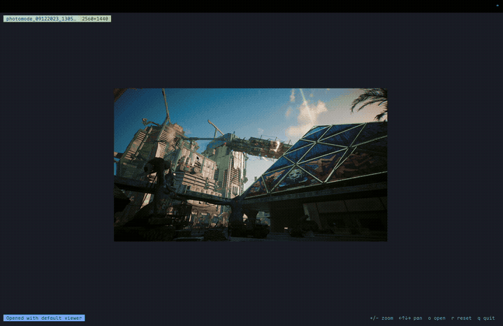
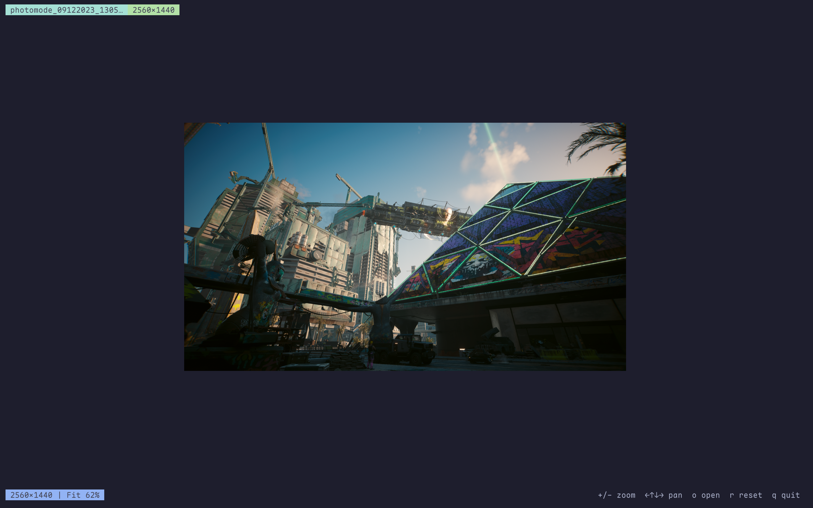

<div align="center">



# Iris

</div>

---

<div align="center">


A terminal image viewer written in Rust, with support for Kitty graphics protocol and automatic fallback to Unicode halfblocks.

</div>

---

<div align="center">

[Features](#-features) • [Installation](#-installation) • [Usage](#-usage) • [Controls](#-controls) • [Terminal Compatibility](#-terminal-compatibility) • [Performance](#-performance)

</div>

---

## Features

- **Kitty Graphics Protocol** — Native support for high-quality terminal image rendering
- **Auto Fallback** — Automatically falls back to iTerm2, Sixel, or Unicode halfblocks depending on terminal capabilities
- **Interactive Mode** — Full TUI with zoom, pan, mouse support, and system default viewer integration
- **File Browser** — Launch without arguments to browse images in the current directory
- **Smart Layout** — Dynamic render area ratios based on terminal size; image is always centered
- **Fit-to-Area** — Images automatically scale to fill the render window on open (preserving aspect ratio)
- **Keyboard Controls** — Vim-style (`hjkl`) and arrow key navigation
- **Mouse Support** — Scroll to zoom, drag to pan, shift/horizontal scroll
- **Open in Default Viewer** — Press `o` to open the current image in your system's default image viewer
- **Performance Optimized** — Crop-before-resize, background worker thread, input debouncing, constrained render area



## Installation

### From crates.io (requires Rust toolchain)

```bash
cargo install iris-viewer
```

The binary is installed as `iris`.

### From Source

```bash
git clone https://github.com/sadlavaarsc/iris.git
cd iris
cargo build --release
```

The binary will be at `target/release/iris`.

### macOS (Apple Silicon)

```bash
cp target/release/iris ~/.local/bin/iris
# Ensure ~/.local/bin is in your PATH
```

## Usage

### Interactive Mode (default)

```bash
iris path/to/image.png
```

### Browse Directory

```bash
iris                    # browse current directory
iris ~/Pictures         # browse specific directory
```

### Static Mode

```bash
iris path/to/image.png --no-interactive
```

### Debug Mode

```bash
iris path/to/image.png --debug
```

Enables benchmark logging to stderr (draw timing, worker thread latency, event counts).

## Controls

### Keyboard

| Key | Action |
|-----|--------|
| `+` / `=` | Zoom in |
| `-` / `_` | Zoom out |
| `←` `↑` `↓` `→` | Pan (1 cell) |
| `h` `j` `k` `l` | Pan (1 cell, vim-style) |
| `w` `a` `s` `d` | Pan (1 cell) |
| `Shift` + arrow / `HJKL` / `WASD` | Pan (5 cells, fast) |
| `Ctrl` + `0` | Reset view (fit to window) |
| `r` | Reset view (fit to window) |
| `o` | Open image in system default viewer |
| `q` / `Esc` | Quit |

### Mouse

| Action | Effect |
|--------|--------|
| Scroll up / down | Zoom in / out |
| Shift + scroll | Pan left / right |
| Horizontal scroll (trackpad) | Pan left / right |
| Drag (left button) | Pan image |
| Scroll left / right | Pan left / right |

## Terminal Compatibility

Iris uses [ratatui-image](https://github.com/benjajaja/ratatui-image) for protocol detection. Supported terminals:

| Protocol | Terminals |
|----------|-----------|
| Kitty | Kitty, Ghostty |
| iTerm2 | iTerm2, WezTerm |
| Sixel | XTerm, MLTerm, mintty |
| Halfblocks | Any truecolor terminal (fallback) |

## Performance

Iris uses several strategies to keep interactive mode responsive even with large images:

- **Crop-before-resize** — Only processes the visible viewport region instead of the full image
- **Background worker thread** — Heavy image processing (`crop` + `resize` + `protocol encode`) runs off the main thread via `std::sync::mpsc`
- **Input debouncing** — 75ms debounce on scroll/keyboard events so rapid inputs only trigger one update
- **Dynamic render area** — Uses more space on small terminals, less on large ones to balance visibility vs. transmission overhead
- **Triangle filter** — Fast resizing filter (instead of Lanczos3) for interactive use
- **Fit-to-area by default** — Large images open pre-scaled to the viewport, avoiding unnecessary full-resolution processing

## Tech Stack

| Component | Crate | Purpose |
|-----------|-------|---------|
| TUI Framework | [ratatui](https://github.com/ratatui-org/ratatui) | Terminal UI framework |
| Terminal I/O | [crossterm](https://github.com/crossterm-rs/crossterm) | Cross-platform terminal events |
| Image Rendering | [ratatui-image](https://github.com/benjajaja/ratatui-image) | Multi-protocol terminal image widgets |
| Image Decoding | [image](https://github.com/image-rs/image) | Standard Rust image processing |
| CLI Parsing | [clap](https://github.com/clap-rs/clap) | Command-line argument parsing |
| Error Handling | [anyhow](https://github.com/dtolnay/anyhow) | Error propagation |

## License

MIT
